# Quadro decisioni — Famiglia Fattura, Fatturazione elettronica, Pagamenti/Tesoreria

**Versione:** v0.1 · 15/08/2026 (aggiornata con la misura del ramo del collega e le prime decisioni chiuse)
**Natura del documento:** documento di lavoro. Vive in `docs/` **senza numero di serie**, e il nome in maiuscolo lo dichiara: non è una specifica e non va letto come tale — contiene voci PROPOSTE e APERTE che nessuno ha deciso.

---

## ⚠️ Cosa è già stato promosso — aggiornato 15/08/2026, sera

Le voci qui sotto **non si leggono più da questo documento**: sono state promosse nelle specifiche, che da quel momento sono la fonte. Restano scritte qui solo per non perdere il filo di come ci si è arrivati.

| Voce del quadro                                                                       | Promossa in                                                                                                           |
| ------------------------------------------------------------------------------------- | --------------------------------------------------------------------------------------------------------------------- |
| A.1.6 · A.1.12 · A.1.13 — casella magazzino della Nota di credito, default, etichetta | `07` §6, «Il magazzino — regola in vigore». Il paragrafo del §5-bis che diceva l'opposto è **ritirato dichiarandolo** |
| Righe miste della Nota di credito                                                     | `07` §6                                                                                                               |
| A.1.14 · A.6 — inclusione documenti, tre filtri, matrice, «Seguirà doc. di vendita»   | `07` §11                                                                                                              |
| A.7 — righe di riferimento per accumulo                                               | `07` §12                                                                                                              |
| A.1.15 · A.8 — Nota di credito senza legame interno, più note sulla stessa fattura    | `07` §13                                                                                                              |
| A.11 — campi trasporto, liste gestite, seed, avvisi non bloccanti                     | `07` §14                                                                                                              |
| Vincoli Shopify → Fattura                                                             | `07` §15                                                                                                              |
| Segno `credit_note` nelle aggregazioni (censimento **da eseguire**)                   | `07` §16                                                                                                              |
| A.1.16 — tipo documento elettronico determinato                                       | `07` §13                                                                                                              |
| C.0 — eliminazione del ramo, migration da prelevare identica                          | `07` §9 e `06b`                                                                                                       |
| Sconto extra: solo percentuale, nessun campo in euro                                  | `07` §8 e `06b` §A.4-bis                                                                                              |

**Due cose decise dopo la stesura di questo quadro, e che qui non ci sono:**

1. **Un movimento per riga, aggiornato in posto** — regola di sistema, in `regole-gestionale` e in `docs/09-specifica-movimenti-per-riga.md`. La modifica di un documento **non** genera movimenti di rettifica.
2. **L'identità delle righe è stabile** nel salvataggio generico (eseguita il 15/08, `09` §4-bis): è il prerequisito perché un movimento possa restare agganciato alla sua riga.
   **A cosa serve:** raccogliere in un posto solo ciò che è deciso, ciò che è misurato e ciò che è solo proposto, tenendoli separati, in modo che le voci decise possano essere promosse una per una nelle specifiche esistenti.

**Immagini:** le schermate citate stanno in `img/` accanto a questo file. Se il documento viene spostato, la cartella va con lui.

**Fonti confluite qui:**

1. decisioni prese nelle sessioni di lavoro (agosto 2026);
2. rapporto di ricognizione di Claude Code (15/08) — fili A e B;
3. mandato `VESTIF_2.MD` prodotto da GPT (15/08);
4. riserve sollevate in revisione;
5. misura del ramo `feature/fattura-elettronica` (15/08);
6. `docs/07-specifica-famiglia-fattura.md` e `VestiFlow_Specifica_Famiglia_Fattura_Verifica_Claude_14-08-2026.md`;
7. osservazione diretta di Danea (Nota di credito, 15/08).

---

## 0 · Legenda degli stati — regola di lettura

Ogni voce di questo documento porta uno dei quattro stati. **Nessuna voce va letta come decisa se non lo dichiara.**

| Stato        | Significato                                                        | Può entrare in `docs/`?                       |
| ------------ | ------------------------------------------------------------------ | --------------------------------------------- |
| **DECISO**   | Deciso da Luigi, con data                                          | Sì                                            |
| **MISURATO** | Verificato sul repository o sul database, con data della misura    | Sì, come stato di fatto — **la misura scade** |
| **PROPOSTO** | Viene da Claude Code, da GPT o da revisione. Materiale da decidere | **No**                                        |
| **APERTO**   | Domanda esplicita che attende risposta di Luigi                    | No                                            |

**Avvertenza sulle date delle misure.** Una misura vale il giorno in cui è stata fatta. Il database è unico e condiviso e il collega ha due rami attivi: qualunque misura anteriore va rifatta al momento in cui si agisce, non riusata.

**Avvertenza sul materiale GPT.** `VESTIF_2.MD` marca decine di voci «STATO: DECISO». Quel marcatore è del documento, non di Luigi. In questo quadro tutte quelle voci sono state **riclassificate**: DECISO solo se corrisponde a una decisione effettivamente presa in sessione; altrimenti PROPOSTO.

**Nota terminologica.** In `VESTIF_2.MD` l'etichetta «STATO: APERTO» in testa a un paragrafo significa «decisione non presa». Non si riferisce allo stato di una fattura. Le due cose sono state confuse in lettura e vanno tenute distinte.

---

## 1 · Presupposti non nostri

Questa sezione esiste perché il mandato GPT dà per esistenti funzionalità che VestiFlow non ha. Se non vengono censite, rientrano a ogni rilettura.

| Presupposto usato da GPT                                         | Stato reale in VestiFlow                                                   | Dove compare                   |
| ---------------------------------------------------------------- | -------------------------------------------------------------------------- | ------------------------------ |
| **Stato finanziario del documento** (aperta / pagata / parziale) | Non esiste. Dipende dallo scadenzario lato vendita, che non è implementato | §27.1, §27.2, PAG-012, PAG-013 |
| **Scadenze / partite aperte**                                    | Non esistono                                                               | §20, §21                       |
| **Movimenti finanziari reali** (incassi/pagamenti)               | Non esistono lato vendita documentale                                      | §22                            |
| **Allocazioni** movimento ↔ partita                              | Non esistono                                                               | §23, §24                       |
| **Risorse finanziarie** (banche, casse come entità)              | Non esistono nella forma richiesta                                         | §26                            |
| **Credito cliente / compensazione da NC**                        | Non esiste                                                                 | §27                            |
| **Registro Pagamenti / Tesoreria**                               | Non esiste                                                                 | §39.9                          |
| **Stati elettronici, provider, notifiche SdI**                   | Non in `develop`. Materia del ramo `feature/fattura-elettronica`           | FE-N, FE-Q                     |
| **Archivio XML immutabile**                                      | Non in `develop`. Materia del ramo del collega                             | FE-O                           |

**Conseguenza operativa.** Ogni scenario `PAG-*` e ogni scenario `FE-*` di `VESTIF_2.MD` descrive il comportamento di un modulo che non esiste. Sono obiettivi, non verifiche. Non vanno dati a Claude Code come test da far passare.

**Precisazione sul legame DDT ↔ Fattura, che invece esiste.**
**MISURATO / DECISO.** Il collegamento tra DDT e Fattura non passa da uno stato del documento: passa dall'**inclusione documenti**, nei due versi possibili —

1. dalla Fattura si include un DDT esistente;
2. dal DDT si genera la Fattura.

È questo il legame reale, ed è l'unico. Dove GPT parla di «fattura aperta» in senso documentale, il concetto corretto da usare è l'inclusione.

---

## 1-bis · Principi trasversali

Valgono su tutti i blocchi e su tutti i documenti. Non appartengono a un modulo: sono regole di sistema.

### Nessuna modifica retroattiva automatica

**DECISO 15/08.**

Il documento salvato conserva i valori che aveva al salvataggio: descrizione, prezzo, sconto, IVA, intestazione e indirizzi. Una modifica in anagrafica, al listino o alle aliquote **non tocca i documenti già emessi**. La modifica vale da lì in avanti.

**Il confine è chi agisce.** L'operatore può modificare a mano un documento, nei limiti dei permessi; il sistema non lo modifica mai da sé. Una modifica voluta è responsabilità di chi la fa, una modifica automatica non se ne accorge nessuno.

**Conseguenza tecnica:** i documenti non leggono i dati correnti, li **copiano al salvataggio**. Una maschera che mostrasse la descrizione leggendola dall'anagrafica cambierebbe da sola il giorno in cui qualcuno rinomina l'articolo.

**Precedente già in vigore:** la decisione sulle varianti — un articolo già usato si disattiva, non si cancella, perché documenti e report restano intatti e non sono mai retroattivi. È lo stesso principio.

### Quando l'anagrafica diverge, il documento lo dichiara

**DECISO 15/08.** _Comportamento osservato su Danea._

Riaprendo un documento il cui soggetto è cambiato in anagrafica, compare nella sezione intestazione/indirizzi un comando **`Aggiorna anagrafica con i nuovi dati`**.

Il sistema **segnala la divergenza e offre l'aggiornamento; non lo applica da sé.** L'operatore decide caso per caso — ed è la scelta giusta perché solo lui sa quale dei due valori è corretto: sulla fattura di tre mesi fa l'indirizzo vecchio è quello a cui è andata la merce; su un preventivo aperto ieri probabilmente si vuole il nuovo.

Un aggiornamento silenzioso sarebbe una modifica retroattiva. Un pulsante è un'offerta.

**Da verificare, non assumere:**

- se VestiFlow abbia già un comando equivalente, e su quali maschere (**il perimetro va nominato**);
- da cosa si rileva la divergenza: confronto campo per campo fra snapshot e anagrafica, oppure data di ultima modifica. **La seconda strada potrebbe richiedere una colonna.**

### Documenti protetti dopo l'emissione

_Osservato su Danea, materia del blocco C._ Una fattura già trasmessa è marcata **«Documento protetto da modifica – sblocca (F11)»**. Non è un blocco: è un lucchetto che si apre di proposito. Coerente con «controlli = avvisi, mai blocchi».

### Controlli e blocchi — riformulazione da riprendere

⚠️ **PROPOSTA, non decisa. Registrata 15/08 per creare il contesto, da riprendere isolata.**

Il principio in vigore è **«controlli = avvisi, mai blocchi»**, con l'eccezione già dichiarata da Luigi: _salvo dove una modifica sarebbe priva di senso_ (es. modifica di un ordine Shopify che il prossimo webhook sovrascriverebbe).

Con lo SdI dentro il perimetro (blocco C) la formulazione potrebbe non bastare: un XML senza partita IVA del cessionario non è un documento incompleto, è un file che lo SdI rifiuta. La proposta è articolarla su tre livelli:

1. **Salvataggio gestionale** — permissivo dove possibile. Il documento incompleto si salva; il sistema segnala cosa manca e lascia procedere. _Già osservato e confermato (A.11)._
2. **Invio elettronico** — bloccato dagli errori realmente bloccanti: dati obbligatori mancanti o incompatibili, verificabili localmente prima della trasmissione.
3. **Tutto il resto** — warning non bloccanti.

**Perché non la decido io e perché non è ancora chiusa:** il principio originale è di Luigi e vale su tutto il gestionale; questa è una modifica a una regola di sistema, non una pulizia di incoerenza. Va ripresa a sé, insieme al blocco C, quando ci sarà il quadro delle regole SdI.

**Rischio da tenere presente in entrambe le direzioni:** un blocco tarato male ferma emissioni legittime (il falso positivo di cui parla FE-D.2 di GPT); un blocco assente manda allo SdI file che verranno scartati, e lo scarto arriva dopo, quando correggere costa di più.

---

# BLOCCO A · Famiglia Fattura

**Destinazione:** `docs/07-specifica-famiglia-fattura.md`
**Prerequisito dal ramo del collega:** una riga di SQL (vedi A.3.1). Nient'altro.

## A.1 · Deciso

| #      | Voce                                                                                                                                                                                                                                                                             | Data                           |
| ------ | -------------------------------------------------------------------------------------------------------------------------------------------------------------------------------------------------------------------------------------------------------------------------------- | ------------------------------ |
| A.1.1  | Fattura, Fattura accompagnatoria e Nota di credito sono **tre tipi di una sola famiglia**: un registro, una maschera di base, una famiglia di permessi                                                                                                                           | 14/08                          |
| A.1.2  | **Numerazione unica e continua** fra i tre tipi                                                                                                                                                                                                                                  | 14/08                          |
| A.1.3  | **Percorsi separati per tipo**, con il tipo dichiarato nell'indirizzo                                                                                                                                                                                                            | 14/08                          |
| A.1.4  | Pulsante **«Nuovo» a tendina** con le tre voci, sciolto dal filtro attivo dell'elenco                                                                                                                                                                                            | 14/08                          |
| A.1.5  | Nota di credito: **quantità e importi positivi**, il verso economico negativo è dato dal **tipo documento** (modello B). Mai il segno nella quantità                                                                                                                             | 14/08                          |
| A.1.6  | Nota di credito: la casella magazzino nasce **non spuntata**. _L'etichetta corretta è «Carica magazzino» — vedi A.1.13_                                                                                                                                                          | 14/08                          |
| A.1.7  | L'effetto economico della NC è **indipendente** dal rientro fisico della merce                                                                                                                                                                                                   | 14/08                          |
| A.1.8  | **Fuori perimetro del blocco A**: Fattura d'acconto, Autofattura, sezionale separato della NC. ⚠️ **Lo SdI non è più fuori perimetro complessivo** (superato 15/08): resta fuori dal _blocco A_, ma la fatturazione elettronica è materia attiva del blocco C                    | 14/08, rivista 15/08           |
| A.1.9  | Il 422 osservato sull'Accompagnatoria il 13/08 **non è un difetto**: artefatto del payload di prova                                                                                                                                                                              | 14/08                          |
| A.1.10 | **Regola generale dell'uscita fisica**: il documento che registra per primo l'uscita genera il movimento. I successivi ereditano o referenziano quell'evento, non lo replicano                                                                                                   | §19.1, 14/08                   |
| A.1.11 | **Default di «Scarica mag.» sulla Fattura**: segue l'origine. Documento agganciato che ha già registrato l'uscita → non spuntata. Nessun documento a monte → spuntata. **L'Ordine cliente non conta come uscita**: impegna, non scarica                                          | **15/08**                      |
| A.1.12 | **Default della Nota di credito confermato**: nasce **non** spuntata, qualunque sia l'origine — anche quando generata da una fattura. Verificato che Danea si comporta allo stesso modo                                                                                          | **15/08** (conferma del 14/08) |
| A.1.13 | **Etichetta della casella sulla Nota di credito: «Carica magazzino»**, già in uso. Con quantità positive e verso nel tipo documento, la casella spuntata carica: «Scarica mag.» sarebbe falsa. Danea può usarla perché mette il segno nella quantità — modello scartato il 14/08 | **15/08**                      |
| A.1.14 | **L'inclusione documenti è un elenco filtrato, non una catena cablata.** Tre filtri: cliente, tipo a monte, non ancora consumato. Cardinalità molti-a-uno. Vedi A.6                                                                                                              | **15/08**                      |
| A.1.15 | **La Nota di credito non richiede legame a una fattura VestiFlow.** Può nascere vuota e riferire una fattura esterna o storica con dati inseriti a mano. Vedi A.8                                                                                                                | **15/08**                      |
| A.1.16 | **Il tipo documento elettronico è determinato, mai scelto.** `TD04` compare in sola lettura sulla nota di credito                                                                                                                                                                | **15/08**                      |

## A.2 · Misurato

| #         | Voce                                                                                                                                                                                                                                                                                                                                                | Data misura                 |
| --------- | --------------------------------------------------------------------------------------------------------------------------------------------------------------------------------------------------------------------------------------------------------------------------------------------------------------------------------------------------- | --------------------------- |
| A.2.1     | `credit_note` **non esiste** nell'enum `DocumentType` (19 valori). Zero occorrenze in `schema.prisma`                                                                                                                                                                                                                                               | 14/08                       |
| A.2.2     | `_prisma_migrations` ha 116 righe, nessuna per `20260807020000`                                                                                                                                                                                                                                                                                     | 14/08                       |
| A.2.3     | Il `CASE` di `documents_number_unique` mappa **solo** `invoice_accompanying` (riga 34)                                                                                                                                                                                                                                                              | 15/08                       |
| A.2.4     | La **Fattura non scarica** magazzino; l'**Accompagnatoria sì**                                                                                                                                                                                                                                                                                      | 14/08                       |
| A.2.5     | `available()` interroga `documentCounter` col tipo grezzo → zero contatori per `invoice_accompanying` (e per `credit_note` dal primo giorno, se non corretto)                                                                                                                                                                                       | 14/08                       |
| A.2.6     | `DEDICATED_WORKFLOW_DOCUMENT_TYPES` è aliasato a `DOCUMENT_STOCK_LOAD_TYPES` (`document-defaults.ts:70`)                                                                                                                                                                                                                                            | 15/08                       |
| A.2.7     | `document-type.util.ts` scrive la stessa regola in **due punti**: `documentNumberingType` (r.36) e `documentNumberingTypes` (r.53-58)                                                                                                                                                                                                               | 15/08                       |
| A.2.8     | `document-xml.service.ts` scrive **TD01 costante** per ogni documento; `fatturapa-xml.util.ts` prevede già entrambi i valori                                                                                                                                                                                                                        | 14/08                       |
| A.2.9     | **Il ramo non ha mai toccato il database condiviso — verificato integralmente.** `tenants.tax_regime` non esiste; `credit_note` non è nell'enum (19 valori); `_prisma_migrations` ha 119 righe e **nessuna** per le due migration del ramo; le ultime applicate sono le vostre del 14/08. Nessuna colonna orfana, nessuna migration da disapplicare | **15/08**                   |
| A.2.9-bis | `company_profiles.tax_regime` esiste: **1 profilo, 0 valorizzati**                                                                                                                                                                                                                                                                                  | **15/08**                   |
| A.2.10    | Il ramo si è mosso **una volta sola** dopo la divergenza del 6/08: un commit del 7/08, **68 file, +2305/-378**, con test veri (4 file di spec) e validatori a checksum ufficiali                                                                                                                                                                    | 15/08                       |
| A.2.11    | `develop` si è mossa di **231 commit** nello stesso periodo. **34 dei 68 file del ramo sono contesi**                                                                                                                                                                                                                                               | 15/08                       |
| A.2.12    | Il file più conteso è `sales-document-form.component.ts`: develop **+944/-166**, ramo **+92/-16**. Seguono `documents.service.ts`, `document-xml.service.ts`, `fatturapa-xml.util.ts`, `document-type.util.ts`                                                                                                                                      | 15/08                       |
| A.2.13    | **Collisione concettuale sul regime fiscale**: ramo su `tenants.tax_regime` (NOT NULL DEFAULT 'RF01'), develop dal 14/08 su `company_profiles.tax_regime` (nullable, NULL = non dichiarato) con schermata dedicata. Due `ALTER TABLE` su tabelle diverse: **git non lo segnala come conflitto**                                                     | 15/08                       |
| A.2.14    | Danea, Nota di credito: quantità **negative** (-5, -4, -4), casella «Scarica mag.» e caselle **vuote** anche su nota generata da fattura, con catena di riferimenti ereditata come righe descrittive (Fattura, DDT, Ordine)                                                                                                                         | 15/08, osservazione diretta |

## A.3 · Proposto — sequenza di lavoro

Fonte: rapporto Claude Code del 15/08, filo A. Ordine conservato.

| #      | Voce                                                                                                                                                                                          | Migration                                     |
| ------ | --------------------------------------------------------------------------------------------------------------------------------------------------------------------------------------------- | --------------------------------------------- |
| A.3.1  | Aggiungere `credit_note` all'enum `DocumentType`                                                                                                                                              | **Additiva**                                  |
| A.3.2  | Ricostruire `documents_number_unique` aggiungendo `credit_note → invoice_draft` al `CASE`                                                                                                     | **Ricostruzione indice**, nessun dato toccato |
| A.3.3  | `document-type.util.ts`: includere `credit_note` in **entrambe** le funzioni                                                                                                                  | no                                            |
| A.3.4  | Aggiungere `credit_note` a `NON_STOCK_DOCUMENT_TYPES`                                                                                                                                         | no                                            |
| A.3.5  | Spostare i tre cancelli da **tipo** a **origine**: «Scarica mag.» compare anche sulla Fattura, il default di riga segue chi genera il documento, conferma di scarico per la famiglia intera   | no                                            |
| A.3.6  | Correggere `available()` e il pannello Numerazioni                                                                                                                                            | no                                            |
| A.3.7  | Sganciare `DEDICATED_WORKFLOW_DOCUMENT_TYPES` dall'alias, dargli i tre tipi espliciti, aggiungere il ramo di carico della nota (altrimenti la NC nasce increabile: 422 dal percorso generico) | no                                            |
| A.3.8  | Elenco unico «Fatture» con colonna «Tipo doc.» e sottotitolo riscritto                                                                                                                        | no                                            |
| A.3.9  | Percorsi separati per tipo, tipo nell'URL — estendere alla NC la regola già in vigore per l'accompagnatoria                                                                                   | no                                            |
| A.3.10 | Menù «Nuovo» a tendina                                                                                                                                                                        | no                                            |
| A.3.11 | `StockMovementType.return` per il carico di rientro, costo dalla riga della fattura d'origine (non il costo corrente)                                                                         | no                                            |

### Vincoli tecnici sulle due migration

**V1 — Contenuto identico al ramo del collega.** La migration `20260807020000_credit_note_document_type` va portata **identica**: stesso nome cartella, stesso contenuto. Il motivo non è che Prisma la creda già applicata (non lo è, e `migrate deploy` la applicherà) ma il **checksum**: stesso nome con contenuto diverso fa fallire `deploy` su chiunque l'abbia già applicata. Vale anche se il ramo del collega venisse chiuso: una migration nostra con nome diverso che aggiunge lo stesso valore rende impossibile un rientro parziale futuro.

**V2 — Due file, non uno.** `ALTER TYPE ... ADD VALUE` e l'uso del nuovo valore **non possono stare nella stessa transazione** in PostgreSQL, e Prisma esegue ogni file in una transazione. A.3.1 e A.3.2 devono quindi essere **due migration separate**. _Stato: dedotto dal comportamento noto di Postgres, non misurato su questo schema — da verificare prima di applicare._

**V3 — Collisioni.** Il `CREATE UNIQUE INDEX` di A.3.2 fallisce se esistono una Fattura e una Nota di credito con lo stesso numero. La verifica va rifatta **nel momento in cui si applica**.

## A.4 · Riserve da sciogliere prima del via

| #         | Riserva                                                                                                                                                                                                                                                                                                                                                                         | Stato                                                                                                                                                                                                                                                                                                                                                 |
| --------- | ------------------------------------------------------------------------------------------------------------------------------------------------------------------------------------------------------------------------------------------------------------------------------------------------------------------------------------------------------------------------------- | ----------------------------------------------------------------------------------------------------------------------------------------------------------------------------------------------------------------------------------------------------------------------------------------------------------------------------------------------------- |
| A.4.1     | **`invoice_draft` è davvero la Fattura?** A.3.2 propone `credit_note → invoice_draft` perché così fa l'accompagnatoria. Se `invoice_draft` fosse la Fattura proforma, la mappatura sarebbe sbagliata in partenza: la proforma ha un progressivo suo. Va **letto**, non assunto                                                                                                  | ✅ **CHIUSA 15/08 — sì.** `proforma` è un valore distinto, con contatore, prefisso `PRO` e titolo propri; `invoice_draft` porta etichetta «Fattura», prefisso `FT`, e l'indice già in produzione mappa **già** `invoice_accompanying → invoice_draft`. Il nome è un fossile di quando VestiFlow preparava bozze per il commercialista: vedi `07-…§21` |
| A.4.2     | **Tipo di movimento del rientro.** `return` sembra corretto e i report lo contano già a segno negativo                                                                                                                                                                                                                                                                          | **APERTO — conferma in implementazione**                                                                                                                                                                                                                                                                                                              |
| A.4.3     | **Generazione della NC da una fattura.** ⚠️ _Riformulata 15/08: non è inclusione_ — la NC non include nulla (A.6), viene **generata**. La verifica riguarda quindi il meccanismo di generazione e la relazione documento-documento: esiste, e regge il caso? Dichiarato _non verificato_ dalla 06 e dal §19.3                                                                   | **APERTO — verifica prima di scrivere**                                                                                                                                                                                                                                                                                                               |
| ~~A.4.4~~ | ~~`tenants.tax_regime` esiste già?~~                                                                                                                                                                                                                                                                                                                                            | **CHIUSA 15/08 → A.2.9. Non esiste. Rischio database azzerato**                                                                                                                                                                                                                                                                                       |
| A.4.5     | **Da cosa dipende l'etichetta della casella?** Se è scelta per tipo documento, la nota si innesta senza toccare nulla; se è cablata nella maschera, va spostata — il punto A.3.5 fa comparire la colonna anche sulla Fattura, dove deve leggersi «Scarica»                                                                                                                      | **APERTO — lettura di codice**                                                                                                                                                                                                                                                                                                                        |
| A.4.6     | **Il regime fiscale è dichiarato da qualcuno?** `company_profiles.tax_regime` ha 0 valori su 1 profilo (A.2.9-bis). La schermata esiste ma **nessuno l'ha compilata**: nei fatti, oggi, l'XML esce con RF01 di default per tutti. Il bug che entrambi i lati volevano correggere **è ancora vivo in `develop`** — non perché il codice sia sbagliato, ma perché il dato non c'è | **APERTO — non è un problema di merge, è un problema di prodotto**                                                                                                                                                                                                                                                                                    |

## A.5 · Decisioni che restano a Luigi

| #             | Domanda                                                                                                                                                                      | Elementi già in campo                                                                                       |
| ------------- | ---------------------------------------------------------------------------------------------------------------------------------------------------------------------------- | ----------------------------------------------------------------------------------------------------------- |
| ~~A.5.1~~     | ~~Fattura senza DDT può scaricare?~~                                                                                                                                         | **CHIUSA 15/08 → A.1.11**                                                                                   |
| ~~A.5.1-bis~~ | ~~Catena dei riferimenti ereditata dalla NC~~                                                                                                                                | **CHIUSA 15/08 → A.7.** Eredita le righe descrittive del predecessore e vi aggiunge la propria              |
| A.5.2         | **La conversione applicata all'Ordine cliente** — sblocca l'aggancio degli ordini di canale alla fattura, ma tocca il flusso «Concludi ordine». Pezzo più grande degli altri | Segnalato da Claude Code come il punto su cui chiedere conferma prima di aprire l'editor                    |
| ~~A.5.3~~     | ~~NC riferita a fattura esterna o storica~~                                                                                                                                  | **CHIUSA 15/08 → A.1.15 e A.8.** Nessun obbligo di legame interno                                           |
| A.5.4         | **Collegamento riga NC → riga fattura** — serve per residuo accreditabile e per evitare over-credit su note parziali multiple                                                | Da `VESTIF_2.MD` §15. **Nessuna colonna nuova prima della verifica** che il legame riga-riga non esista già |
| A.5.5         | **Regola di over-credit** — cosa fare con righe già interamente accreditate, e in annullamento di una NC                                                                     | Da `VESTIF_2.MD` §16, §39.5                                                                                 |
| ~~A.5.6~~     | ~~Set finale dei campi trasporto dell'Accompagnatoria~~                                                                                                                      | **CHIUSA 15/08 → A.11**                                                                                     |

## A.6 · Inclusione documenti

**Stato: meccanismo esistente in VestiFlow. Nessuna migration sul modello base — due verifiche aperte.**

### Non è una catena, è un'inclusione

⚠️ **Correzione a materiale precedente.** La verifica del 14/08 (§9.2, §10.1) scrive «catena attesa: Ordine cliente → DDT → Fattura» come se il percorso fosse cablato. **Non lo è.** Il documento non nasce dal suo predecessore designato: l'operatore apre un documento e sceglie cosa includerci, con il pulsante «Includi documento».

Chi implementa leggendo «catena attesa» costruisce un binario. Il modello reale è un elenco filtrato.

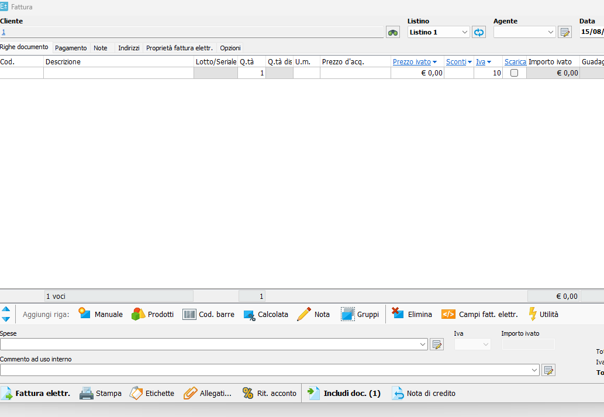

_Danea, Fattura vuota. Il pulsante «Includi doc. **(1)**» è a piè di documento, fratello di «Nota di credito»: uno tira dentro, l'altro genera fuori. Il contatore in parentesi dice che c'è qualcosa da includere per quel cliente **prima** che l'operatore apra il menu, e si aggiorna al cambio cliente._

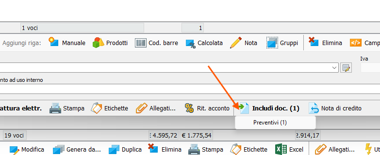

_Il menu mostra solo i tipi che hanno qualcosa da offrire, ciascuno col proprio conteggio. Qui compare solo `Preventivi (1)` — gli altri tipi ammessi esistono ma sono vuoti per quel cliente, quindi non compaiono._

### I tre filtri dell'elenco

Ciò che compare in «Includi documento» è determinato, nell'ordine:

1. **Cliente** — solo i documenti di quel cliente. Finché il cliente non è scelto non c'è nulla da includere (la maschera lo dice: _«Scegli il cliente e la location»_).
2. **Tipo** — solo i tipi che stanno a monte. Vedi matrice.
3. **Stato** — solo i documenti non ancora consumati.

### Matrice dei tipi includibili

Si include **solo ciò che sta a monte**. Non per mancanza di funzione: includere un documento a valle vorrebbe dire tornare indietro nel flusso.

| Documento               | Può includere                            | Fonte                                                                                                                                     |
| ----------------------- | ---------------------------------------- | ----------------------------------------------------------------------------------------------------------------------------------------- |
| Ordine cliente          | Preventivi                               | **dichiarato 15/08**                                                                                                                      |
| DDT vendita             | Preventivi, Ordini cliente               | **dichiarato 15/08**                                                                                                                      |
| Fattura                 | Preventivi, Ordini cliente, DDT          | **dichiarato 15/08**                                                                                                                      |
| Fattura accompagnatoria | Preventivi, Ordini cliente — **mai DDT** | **dichiarato 15/08**: sostituisce il DDT nella stessa uscita, includerne uno sarebbe la stessa contraddizione della Fattura dentro un DDT |

**La matrice è chiusa: nessuna riga dedotta.**

**La Nota di credito non è in questa tabella: non include nulla** (dichiarato 15/08). Nasce vuota dal menù «Nuovo», oppure viene **generata** da una fattura. Sono due gesti diversi e non vanno confusi:

- **Includere** = apro un documento e ci tiro dentro qualcosa che esiste già.
- **Generare** = da un documento aperto ne creo un altro.

Danea li tiene distinti anche nell'interfaccia: a piè di fattura ci sono **due pulsanti separati**, `Includi doc.` e `Nota di credito`.

### Il terzo filtro: «non ancora consumato»

Un documento incluso in un altro deve **sparire dall'elenco** per i successivi, o si fattura due volte la stessa merce.

**Caso misurato in VestiFlow (15/08):** sul DDT vendita esiste la casella **«Seguirà doc. di vendita»**. È una **dichiarazione d'intenzione**, spuntata dall'operatore _prima_ che la fattura esista: dice «questo DDT andrà fatturato». La fattura mostra solo i DDT così marcati.

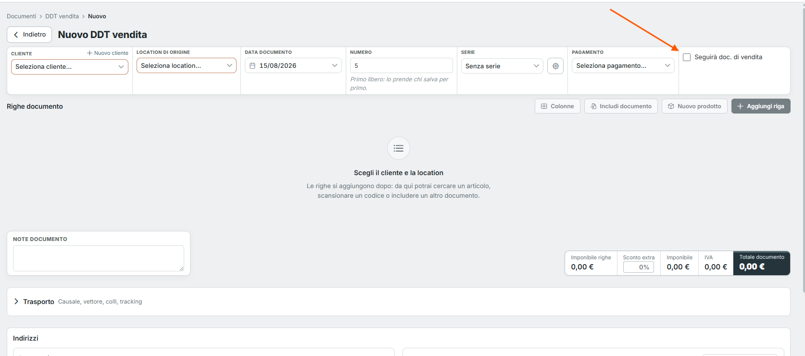

_VestiFlow, Nuovo DDT vendita. La casella «Seguirà doc. di vendita» è in testata, ultima a destra dopo Pagamento. Nella stessa schermata: «Includi documento» fra i comandi delle righe, e il messaggio a documento vuoto — «Le righe si aggiungono dopo: da qui potrai cercare un articolo, scansionare un codice o **includere un altro documento**». L'inclusione è già una delle tre strade dichiarate all'operatore._

**È un filtro diverso dagli altri due:** la matrice dice quali _tipi_ sono ammessi, questa casella dice quali _documenti concreti_ compaiono. Il tipo lo decide il modello, il singolo documento lo decide chi ha compilato il DDT.

**Lo stesso concetto vale per gli altri tipi**, con nomi diversi: un preventivo già trasformato in ordine, un ordine già evaso. La spunta del DDT è un caso particolare di «non ancora consumato».

**Precedente già in vigore:** la decisione del 14/08 sui DDT che restano bloccati dopo una nota di credito presuppone che lo stato «già fatturato» esista da qualche parte.

### Cardinalità

**Molti-a-uno, già supportato** (dichiarato 15/08): in una fattura si possono includere più DDT.

### Verifiche aperte

| #     | Voce                                                                                                                                                                                                                                                                                                                                                                                                                                                                      | Perché conta                            |
| ----- | ------------------------------------------------------------------------------------------------------------------------------------------------------------------------------------------------------------------------------------------------------------------------------------------------------------------------------------------------------------------------------------------------------------------------------------------------------------------------- | --------------------------------------- |
| A.6.1 | **Il legame regge tipi misti?** Due preventivi _e_ tre DDT nello stesso documento. Se il legame porta con sé il tipo, siamo a posto; se il tipo è implicito nella relazione, no                                                                                                                                                                                                                                                                                           | **Decide se qui serve una migration**   |
| A.6.2 | **Come è modellato lo stato di consumo?** Campo sul documento incluso, oppure dedotto dall'esistenza del legame                                                                                                                                                                                                                                                                                                                                                           | **Decide se serve una colonna**         |
| A.6.3 | **Default di «Seguirà doc. di vendita»: non spuntata** (DECISO 15/08). Criterio: chi non fa nulla finisce nel caso meno dannoso — un DDT interno non spuntato non sporca l'elenco degli includibili, mentre un DDT da fatturare non spuntato si scopre quando serve. **Resta aperto** se serve un avviso: un DDT uscito senza spunta è invisibile alla fattura, la merce è consegnata e non risulta da fatturare, e ci si accorge quando il cliente non riceve la fattura | **DECISO il default · APERTO l'avviso** |

---

## A.7 · Righe di riferimento fra documenti collegati

**Stato: DECISO 15/08. Nessuna migration.**

### La regola

Ogni documento che nasce da un altro **copia le righe di riferimento presenti nel documento di partenza e vi aggiunge la propria**.

La catena si costruisce per **accumulo progressivo**, non risalendo i legami. Nessuna query ricostruisce l'albero a monte: ogni documento guarda solo il proprio predecessore diretto, ne eredita le righe di riferimento insieme alle altre righe, e in testa scrive il riferimento a quel predecessore.

### Come si accumula — esempio verificato su Danea il 15/08

| Documento                    | Righe di riferimento presenti                         | Aggiunta propria |
| ---------------------------- | ----------------------------------------------------- | ---------------- |
| Ordine 122 del 31/07         | —                                                     | —                |
| DDT 17 del 31/07             | `Rif. Ordine 122`                                     | Ordine           |
| Fattura 19 del 31/07         | `Rif. DDT 17` · `Rif. Ordine 122`                     | DDT              |
| Nota di credito 20 del 15/08 | `Rif. Fattura 19` · `Rif. DDT 17` · `Rif. Ordine 122` | Fattura          |

_Verificato direttamente su due schermate: la Fattura mostra 5 voci (2 riferimenti + 3 prodotti), la Nota di credito 6 (3 riferimenti + 3 prodotti)._

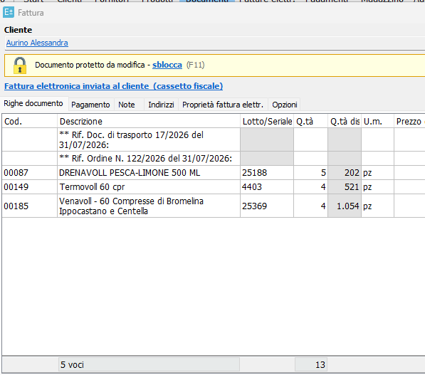

_Danea, Fattura 19. Due righe di riferimento in testa — DDT 17 e Ordine 122 — poi i tre prodotti con quantità positive (5, 4, 4) e la colonna «Q.tà disp.». Piè di lista: `5 voci`, totale quantità `13`. Il documento è marcato «Documento protetto da modifica – sblocca (F11)» perché la fattura elettronica è già stata inviata._

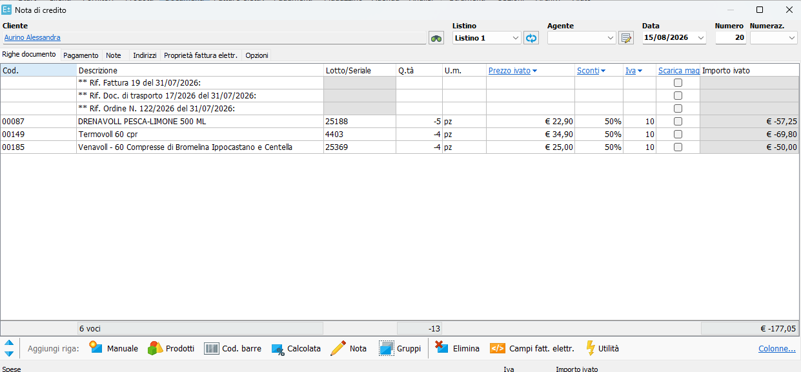

_Danea, Nota di credito 20 generata dalla Fattura 19. Tre righe di riferimento: `Rif. Fattura 19` in testa (la nuova), poi `Rif. Doc. di trasporto 17/2026` e `Rif. Ordine N. 122/2026` ereditate. Quantità **negative** (-5, -4, -4), piè di lista `6 voci`, `-13`, `€ -177,05`. Le caselle «Scarica mag.» sono **tutte vuote**, anche su nota generata da fattura._

### Natura delle righe

Sono **righe di documento a tutti gli effetti**, non un campo di testata né un blocco fisso:

- occupano posizione nell'elenco e sono contate fra le voci;
- non hanno codice articolo, quantità, prezzo né importo;
- sono **eliminabili manualmente** dall'operatore, come qualunque altra riga;
- non sono ancorate in testa: stanno lì perché sono state inserite per prime.

### Perché è la forma giusta, e cosa non è

Sono **testo**, non riferimenti strutturati. È un vantaggio e un limite insieme, e vanno tenuti presenti entrambi:

- **Vantaggio:** la catena resta leggibile anche se un documento a monte viene cancellato o modificato. Il testo sopravvive al legame. Nessun costo di lettura, nessun join, nessuna dipendenza da relazioni che potrebbero non esistere.
- **Limite:** non sono un dato interrogabile. Non ci si può costruire sopra un controllo, un filtro o una tracciabilità. Per quello serve il legame strutturato, che è cosa diversa e vive altrove (vedi C.3-bis per il piano elettronico).

**I due piani vanno tenuti separati e non confusi:** le righe descrittive servono all'operatore e alla stampa; il riferimento strutturato serve al sistema e allo SdI. Danea li tiene distinti apposta, ed è la scelta corretta.

### Il meccanismo esiste già in VestiFlow su altri documenti

_Dichiarato da Luigi il 15/08._

Non è una funzione da costruire, e non è nemmeno una funzione dedicata: **non esiste un meccanismo dei riferimenti.** Quando un documento nasce da un altro, le righe vengono copiate; fra quelle righe ci sono anche le descrittive di riferimento, che viaggiano insieme alle altre **perché sono righe come tutte**. In cima viene aggiunta quella che punta al predecessore diretto.

**Il testo della riga è già composto da VestiFlow e va bene così** (dichiarato 15/08). Non è da definire: è da dichiarare come esistente e da estendere, non da riprogettare.

**Perimetro dichiarato:**

| Documento      | Ha il meccanismo | Fonte                           |
| -------------- | ---------------- | ------------------------------- |
| DDT            | **sì**           | dichiarato 15/08                |
| Ordine cliente | **sì**           | dichiarato 15/08                |
| Fatture        | **«dovrebbe»**   | **da verificare, non assumere** |

Quel «dovrebbe» va sciolto prima di scrivere qualsiasi cosa: **se le Fatture non ce l'hanno, il lavoro non è estendere alla Nota di credito — è portare il meccanismo su tutta la famiglia.**

**Da nominare prima di implementare:**

- dove vive il codice che compone il testo della riga;
- se il formato del testo è centralizzato o ripetuto per maschera.

Se risultasse ripetuto in più punti, vale la regola già applicata altrove: prima si unifica, poi si estende. Aggiungere il terzo tipo a una logica già triplicata la triplicherebbe una quarta volta.

### Con più documenti inclusi non è una catena verticale

L'inclusione è molti-a-uno (A.6). Includendo due preventivi si ottengono **due righe** `Rif. Preventivo`, più quelle che ciascuno dei due si portava dietro. Lo schema lineare Ordine → DDT → Fattura → Nota descrive il caso a un documento incluso, che è il più comune ma non l'unico: le righe si **sommano**, non si incolonnano.

### Punti aperti collegati

| #         | Voce                                                                                                                                                                                                                                                                                                    | Stato                                                                                                         |
| --------- | ------------------------------------------------------------------------------------------------------------------------------------------------------------------------------------------------------------------------------------------------------------------------------------------------------- | ------------------------------------------------------------------------------------------------------------- |
| ~~A.7.1~~ | ~~Formato del testo proposto dal sistema~~                                                                                                                                                                                                                                                              | **CHIUSA 15/08: VestiFlow lo compone già e va bene così. Non è da definire — è da dichiarare come esistente** |
| A.7.2     | **Incrocio con l'ordinamento per colonna** (decisione già in coda). Un ordinamento alfabetico o per quantità **sparpaglia i riferimenti fra i prodotti**, e sono righe che l'operatore si aspetta in testa. Non va risolto ora, ma chi implementerà l'ordinamento deve sapere che queste righe esistono | **APERTO — da registrare nella specifica ordinamento righe**                                                  |
| A.7.3     | **Comportamento all'eliminazione manuale.** Se l'operatore cancella una riga di riferimento, il documento successivo che nascerà da questo erediterà la catena mutilata. Accettabile o no?                                                                                                              | **APERTO**                                                                                                    |

---

## A.8 · Nota di credito senza legame interno

**Stato: DECISO 15/08. Nessuna migration.**

### La regola

**La Nota di credito non richiede alcun legame a una fattura VestiFlow.** Può nascere vuota dal menù «Nuovo» e riferire una fattura non presente a sistema — emessa prima dell'adozione del gestionale, o da un altro software — con i riferimenti inseriti a mano.

Quando il legame c'è, i riferimenti vengono ereditati. Quando non c'è, **nulla si blocca**. Coerente con il principio «controlli = avvisi, mai blocchi».

### Cosa è stato osservato su Danea il 15/08

Nota di credito creata da zero, cliente selezionato, nessun documento incluso:

**Scheda «Righe documento»** — completamente vuota. Una riga bianca con q.tà `-1`, prezzo `€ 0,00`, IVA `10`, casella scarico non spuntata, importo `€ 0,00`. Piè di lista: `1 voci`, `-1`, `€ 0,00`. **Nessuna riga di riferimento**, perché non c'è predecessore da cui copiarle.

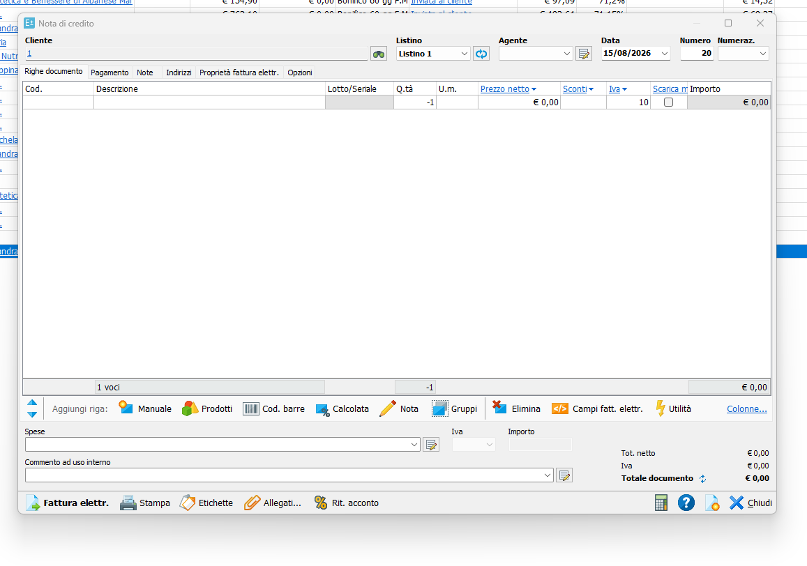

**Scheda «Proprietà fattura elettr.»** — attiva e compilabile:

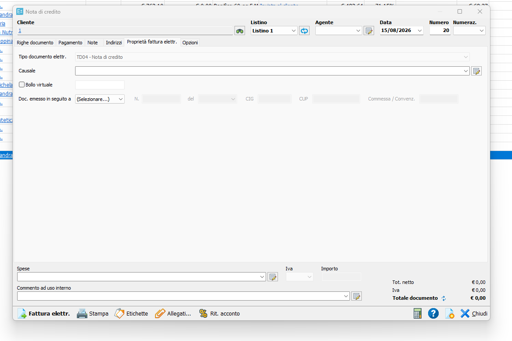

| Campo                           | Stato a documento vuoto                                                                            |
| ------------------------------- | -------------------------------------------------------------------------------------------------- |
| Tipo documento elettr.          | `TD04 - Nota di credito`, **grigio, in sola lettura** — determinato dal tipo documento, mai scelto |
| Causale                         | vuoto, con **suggerimento precompilato in tendina**: `Rif. ... n. ... del ...`                     |
| Bollo virtuale                  | casella non spuntata, importo vuoto                                                                |
| Doc. emesso in seguito a        | `(Selezionare...)` — tendina a sei voci                                                            |
| N. / del / CIG / CUP / Commessa | **disabilitati finché non si sceglie il tipo** nella tendina                                       |

**Le sei voci della tendina** (schema FatturaPA): Ordine d'acquisto, Contratto, Convenzione, Ricezione, Fattura collegata, Doc. di trasporto.

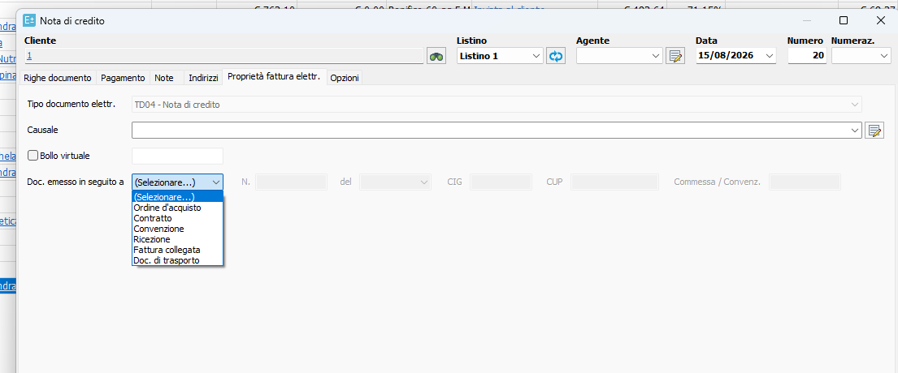

_Non è una lista inventata da Danea: sono i blocchi `DatiOrdineAcquisto`, `DatiContratto`, `DatiConvenzione`, `DatiRicezione`, `DatiFattureCollegate`, `DatiDDT` dello schema SdI. CIG e CUP stanno lì perché il formato li lega agli appalti pubblici — non li compila l'azienda, li chiede la PA._

### Il suggerimento della Causale

`Rif. ... n. ... del ...` non è un campo libero: è un **modello con i buchi da riempire**, offerto in tendina. Danea guida la compilazione senza imporla — dà la forma, il contenuto lo mette l'operatore.

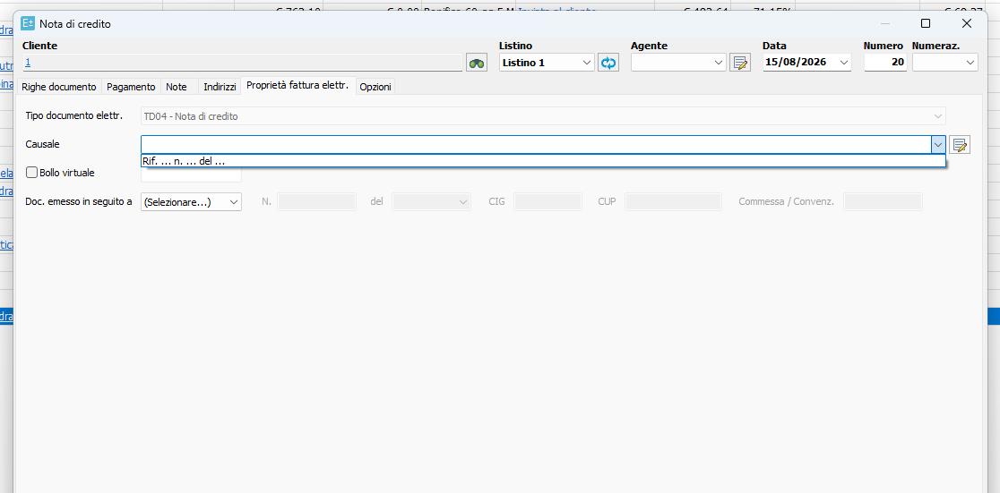

È lo stesso problema del formato delle righe di riferimento (A.7.1): testo che il sistema propone. Le due cose vanno decise insieme e con lo stesso criterio.

### Conseguenza da nominare, non da decidere

**Senza legame non esistono residuo accreditabile né controllo di over-credit.** Quei controlli valgono **solo sulle note legate a una fattura VestiFlow**. Va scritto esplicitamente nella specifica, o chi implementa più avanti li darà per validi su tutte le note e costruirà un blocco dove non può esistere il dato per reggerlo.

### Comportamento dei campi disabilitati

I campi `N.`, `del`, `CIG`, `CUP`, `Commessa` restano **inattivi finché il tipo non è scelto**. È il modello da adottare: il tipo governa l'abilitazione dei campi che lo accompagnano, non il contrario.

---

## A.9 · Struttura della maschera: schede, non una pagina sola

**Osservato su Danea il 15/08. Nessuna decisione presa — registrato come modello di riferimento.**

In Danea la maschera del documento **non è una pagina unica che scorre**: è una fila di schede sotto la testata, che cambiano il contenuto della finestra lasciando fisso tutto il resto.

**Le sei schede, nell'ordine:**

`Righe documento` · `Pagamento` · `Note` · `Indirizzi` · `Proprietà fattura elettr.` · `Opzioni`

**Cosa resta fisso al cambio scheda** — e questa è la parte che conta più dell'elenco:

- **La testata**: Cliente, Listino, Agente, Data, Numero, Numeraz.
- **Il piede**: Spese (con IVA e importo), Commento ad uso interno, e i totali `Tot. netto` / `Iva` / `Totale documento`.
- **La barra comandi**: Fattura elettr., Stampa, Etichette, Allegati, Rit. acconto.

L'operatore non perde mai di vista chi è il cliente e quanto fa il documento, qualunque scheda stia compilando. Cambia solo la fascia centrale.

### Scheda «Indirizzi»

Due colonne affiancate, **Intestatario** e **Destinazione**, ciascuna con Indirizzo, CAP, Città, Prov., Nazione e un collegamento `Mappa...`. Sopra, fuori dalle due colonne perché valgono per il soggetto e non per l'indirizzo: `Cod. fiscale` e `Partita Iva`. Un pulsante `Cambia destinazione...` permette di sostituire la destinazione senza toccare l'intestatario.

**La separazione fra chi riceve la fattura e dove va la merce è strutturale**, non un campo opzionale in fondo.

### Scheda «Proprietà fattura elettr.»

Descritta in A.8. Materia del blocco C.

### Scheda «Pagamento» — ⚠️ non è materia del blocco A

Questa scheda **è il modulo Pagamenti/Tesoreria che VestiFlow non ha** (blocco D). Registrata qui perché è nella stessa maschera, ma **non si progetta nel blocco A**.

Cosa contiene, esattamente:

- **Tipo pagamento**: tendina in testa (`Contanti` nell'esempio).
- **Tabella Pagamenti**, cinque colonne: `Data scadenza` · `Data saldo` · `Importo` · `Saldato` (casella) · `Risorsa` (`Cassa contanti`) · `Rif. pagam.`
- **Totali a lato**: `Da saldare` e `Saldato`, distinti.
- **Comandi «Aggiungi pagamento»**: `Preesistente` (disattivato a documento vuoto), `Acconto`, `Scadenza`, `Modifica`, `Rimuovi`.

**Perché va notato adesso:** quelle colonne sono esattamente i quattro concetti separati del modello finanziario descritto in D.2. `Data scadenza` è la partita, `Data saldo` e `Importo` sono il movimento reale, `Risorsa` è la risorsa finanziaria, e il pulsante `Preesistente` è l'**allocazione** — serve ad agganciare un movimento già registrato a questo documento, che è il caso «un bonifico salda tre fatture».

Non è quindi un dettaglio grafico: è la conferma che il modello a quattro concetti è quello che un gestionale reale espone all'operatore.

### Conseguenza per VestiFlow

**Nessuna decisione presa.** Ma va nominata una cosa prima di implementare: se la maschera della famiglia Fattura adotta la struttura a schede, la scheda `Pagamento` sarà **vuota o assente** finché il blocco D non esiste. Meglio saperlo ora che scoprirlo a maschera fatta.

---

## A.10 · Più note di credito sulla stessa fattura

**Osservato su Danea il 15/08. Nessuna decisione presa.**

### Il controllo esiste, ed è a livello documento

Generando una seconda Nota di credito dalla stessa Fattura, Danea avvisa:

> **Sono già stati precedentemente creati i seguenti documenti a partire da questo:**
> • Nota cred. 20 del 15/8/26 (€ -47,38)
>
> Vuoi creare un altro documento di tipo "Nota di credito"? `OK` `Annulla`

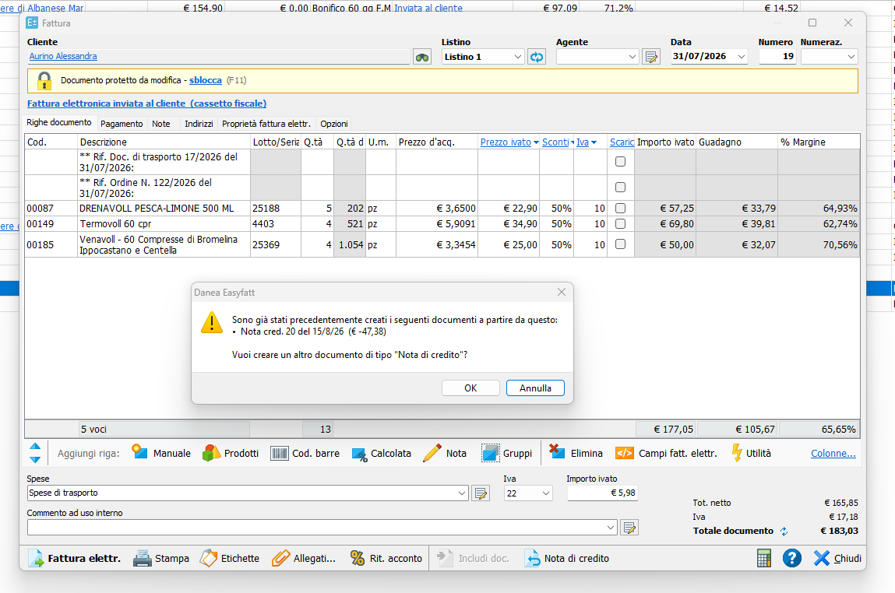

**Caratteristiche del controllo:**

- È un **avviso, non un blocco**: `OK` procede. Coerente con «controlli = avvisi, mai blocchi».
- È **documento-a-documento**: elenca i documenti già generati da questa fattura, con numero, data e importo.
- Non richiede alcun legame riga-riga: basta sapere quali documenti sono nati da questo.
- Compare al **momento della generazione**, non al salvataggio.

### Cosa questo controllo NON è

⚠️ **Non è il controllo di over-credit.** Danea dice «esiste già una nota da questa fattura», non «stai per accreditare più del dovuto». Nulla impedisce di accreditare 300 su una fattura da 100: l'avviso è identico.

Nell'esempio osservato la seconda nota ha quantità `-1 -1 -1` contro `-5 -4 -4` della prima — quantità libere, nessun residuo calcolato.

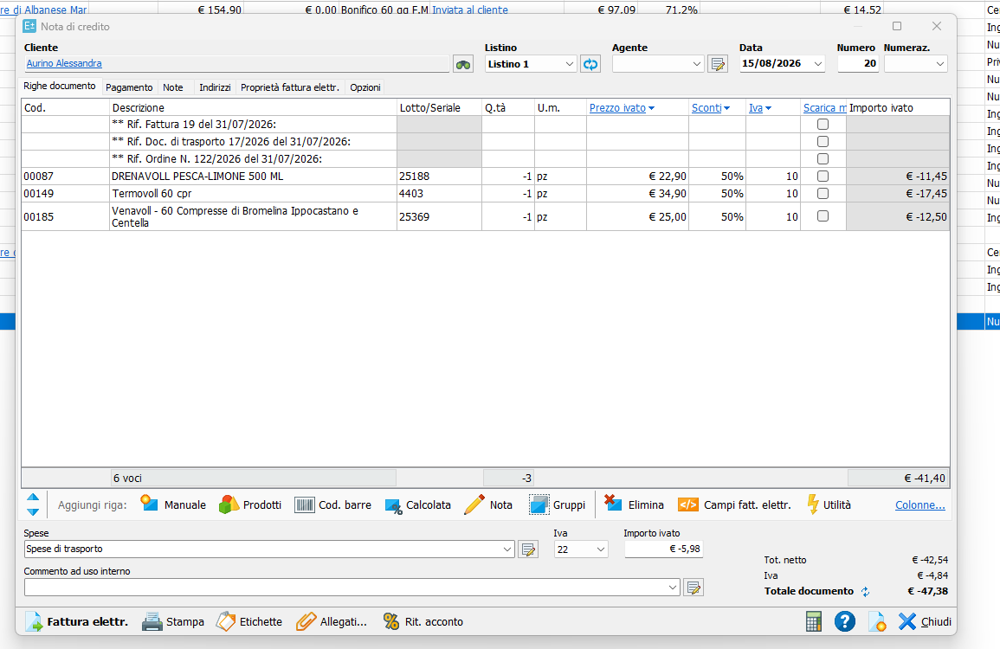

**Conseguenza per la decisione A.5.4:** il residuo accreditabile e il legame riga-riga restano una questione aperta e separata. Il controllo qui osservato si ottiene **senza migration** — richiede solo di sapere quali documenti sono stati generati da questo, informazione che il legame documento-documento già porta.

Se in futuro si vorrà il residuo vero, quello richiede il legame riga-riga, e **quella sì sarebbe una migration**.

### Un secondo avviso, materia del blocco D

Nella stessa nota di credito, scheda Pagamento:

> **Attenzione:** La somma delle scadenze pagamento (€ -183,03) non corrisponde al totale documento (€ -47,38).
> Vuoi comunque procedere ed eseguire la correzione in un secondo momento? `Sì` `No`

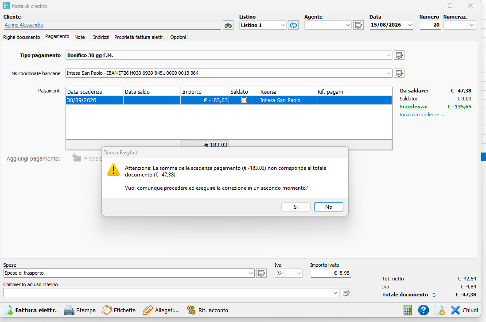

Le scadenze sono state **ereditate dalla fattura d'origine** (€ 183,03, il totale della fattura) mentre la nota vale € 47,38. Il pannello mostra `Da saldare € -47,38`, `Saldato € 0,00` ed **`Eccedenza € -135,65`** in verde, con un collegamento `Ricalcola scadenze...`.

Due cose da tenere, entrambe **blocco D**:

1. **Anche qui è un avviso, non un blocco**: si procede e si corregge dopo.
2. Il campo **`Ns coordinate bancarie`** (`Intesa San Paolo - IBAN IT26...`) compare in testa alla scheda **solo quando il tipo pagamento lo richiede** — nell'esempio `Bonifico 30 gg F.M.`. Stesso modello dei campi disabilitati di A.8: il tipo governa quali campi appaiono.

---

## A.11 · Campi trasporto dell'Accompagnatoria

**Stato: i campi esistono già — nessuna migration. Le liste gestite sono da fare — migration additiva.**

### I campi esistono già sul DDT VestiFlow

⚠️ **Segnalazione migration, in due parti distinte:**

- **Campi trasporto: nessuna migration.** Il DDT VestiFlow ha già l'intero set. _Da verificare che vivano su `Document` e non su una struttura specifica del DDT: se sono già lì, l'accompagnatoria li riusa e basta._
- **Liste gestite: migration additiva.** Vedi sotto.

**Confronto fra i due sistemi, verificato il 15/08:**

| Campo                    | Danea                            | VestiFlow                                                      |
| ------------------------ | -------------------------------- | -------------------------------------------------------------- |
| Causale trasporto        | tendina gestita                  | campo libero, placeholder `Es. Vendita`                        |
| Data inizio trasporto    | un solo campo data+ora           | **due campi**: `Data inizio trasporto`, `Ora inizio trasporto` |
| Porto                    | tendina gestita                  | tendina (unica già a tendina)                                  |
| Incaricato del trasporto | tendina gestita                  | campo libero, `Es. Vettore BRT`                                |
| Numero colli             | numerico + calcolatrice          | numerico                                                       |
| Peso                     | numerico + calcolatrice          | campo libero, `Es. 12,5 kg`                                    |
| Aspetto beni             | tendina gestita                  | campo libero, `Es. Scatole`                                    |
| Codice spedizione        | testo                            | testo                                                          |
| Tracking spedizione      | comando `Tracking spedizione...` | campo `Codice o link tracking`                                 |

**Nota:** in Danea `Trasporto` è una **scheda a sé, la settima**, e compare **solo sull'Accompagnatoria** — nella Nota di credito le schede sono sei e Trasporto non c'è. In VestiFlow è una sezione a fisarmonica dentro la pagina, con sottotitolo «Causale, vettore, colli, tracking».

### Liste gestite dall'utente

**DECISO 15/08.** Quattro campi passano da testo libero a **combo box**: tendina con i valori disponibili, ma campo scrivibile per il caso fuori lista.

- Causale trasporto
- Incaricato del trasporto
- Aspetto beni
- Porto (già a tendina)

**Perché non testo libero:** un negozio scrive «Vendita» su ogni DDT per anni. A mano diventa `vendita`, `Vendtia`, `Vendita ` — e i filtri smettono di funzionare.

**Ogni lista ha la sua maschera di gestione** (DECISO 15/08), aperta da un **pulsante accanto al campo**. In Danea l'icona apre `Elenco Vettori · Modifica elenco voci`, con `Nuovo`, `Elimina`, `Annulla`, `Excel`.

**I campi che portano il pulsante di gestione sono quattro**, e vanno nominati esplicitamente in implementazione: Causale trasporto, Incaricato del trasporto, Aspetto beni, Porto.

### Nessun valore predefinito — i campi nascono vuoti

**DECISO 15/08.** Il campo trasporto **non è precompilato**: si sceglie. Danea ha una colonna `Predef.` nella maschera di gestione; **VestiFlow non la adotta**.

**Quello che invece si trasferisce:** se i campi trasporto sono stati compilati sul DDT, **passano alla Fattura che lo include**, come qualunque altro dato che viaggia con l'inclusione.

**L'unica cosa precompilata sono gli indirizzi**, e non è un predefinito: vengono dall'**anagrafica del destinatario** (cliente o fornitore). Vale qui il principio §1-bis — presi dall'anagrafica al salvataggio, poi il documento è fermo.

⚠️ **Migration additiva.** Serve la struttura per le liste gestite, con valore, ordine e ambito tenant — **senza colonna predefinito**, che non viene adottata. Due forme possibili: **una tabella per lista** (esplicita, quattro tabelle) oppure **una tabella unica con discriminante** (`tipo`, `valore`, `tenant`; le liste future non costano nulla). _Scelta tecnica da nominare a Claude Code, non decisa._

### Seed iniziale: uguale per tutti, poi modificabile

**DECISO 15/08.** Ogni tenant nuovo nasce con **gli stessi valori precompilati**, identici per tutti. Da lì in poi ciascun negozio li modifica dalla maschera di gestione: aggiunge i propri corrieri, toglie le causali che non usa.

La lista non nasce vuota — un negozio che deve creare una causale prima di poter salvare il primo DDT sarebbe un blocco, non un avviso. Ma il seed resta **minimo**: serve a non trovare il vuoto, non a indovinare come lavora ognuno.

Esempio dichiarato per l'incaricato: `Mittente`, `Destinatario`, `BRT`. I primi due non sono corrieri, sono i **ruoli previsti dalla normativa DDT** — ci sono sempre; i corrieri li aggiunge il negozio.

**Causali osservate in Danea** (da verificare col commercialista prima di adottarle come seed):

`C/Lavorazione` · `C/Riparazione` · `C/Visione` · `Conto Vendita` · `Reso` · `Reso da conto Vendita` · `Vendita` · `Vendita On-line`

Due cose da notare: **`Vendita On-line` è una causale a sé** — pertinente al canale Shopify. E il conto vendita ha **due voci accoppiate**, `Conto Vendita` all'andata e `Reso da conto Vendita` al ritorno, distinta dal `Reso` ordinario. Nel settore abbigliamento il conto vendita è comune.

### Due avvisi, entrambi non bloccanti

**Il documento incompleto si può salvare.** Chi compila un DDT alle sette di sera col corriere che aspetta non deve restare fermo perché non sa il numero dei colli.

**1. Campi obbligatori mancanti al salvataggio** — il sistema segnala cosa manca e chiede se procedere. `Sì` salva così com'è.

**2. Valore mancante con proposta automatica** — `Data/ora inizio trasporto non inserita: vuoi impostare quella attuale?` con `Sì` `No` `Annulla` e la casella **«Non mostrare più questo messaggio»**.

**È lo stesso schema del controllo cronologico sui numeri documento**: avviso persistente con dismiss. Vale la pena registrarlo come **modello ricorrente**, non come caso singolo — campo non compilato → avviso con proposta di valore automatico → dismiss per chi lo sa già.

_Da allineare:_ nel controllo cronologico il dismiss è stato deciso **per operatore e irreversibile**. Qui vale lo stesso? Non dichiarato.

### Punto aperto

| #      | Voce                                                                                                                                                                                                                                                    | Stato                         |
| ------ | ------------------------------------------------------------------------------------------------------------------------------------------------------------------------------------------------------------------------------------------------------- | ----------------------------- |
| A.11.1 | **Il documento salvato incompleto resta segnalato dopo?** Danea non lo mostra. Per VestiFlow conta perché i documenti incompleti sono quelli che poi bloccano la fatturazione elettronica: un DDT senza causale passa, una fattura senza partita IVA no | **APERTO — materia blocco C** |

---

## A.12 · Materiale GPT riusabile su questo blocco

- **Scenari FAT-001 … FAT-011** (§34): criteri di accettazione e regressione del **blocco A**, utilizzabili subito.
- _*Scenari PAG-* e FE-_**: criteri di accettazione **futuri** dei blocchi D e C. Non sono verifiche di oggi — descrivono moduli non ancora costruiti — ma vanno conservati come bersaglio.
- **§4.3 — separazione degli effetti**: _Nota di credito ≠ rientro merce ≠ rimborso monetario_. Principio corretto, vale la pena riportarlo così nella 07.
- **§36 — rischi di regressione**: la parte su doppio scarico, doppio rientro, collisione numerazione, tipo errato in modifica, perdita serie e cambio location è pertinente al blocco A. Il resto (banca, IBAN, saldi) riguarda moduli che non esistono.

---

# BLOCCO B · Numerazione

**Destinazione:** `docs/04-specifica-numerazione-documenti.md`
**Entità del lavoro:** minima. La specifica esiste ed è chiusa; qui si tratta solo di innestarci il terzo tipo.

| #   | Voce                                                                                                                             | Stato                          |
| --- | -------------------------------------------------------------------------------------------------------------------------------- | ------------------------------ |
| B.1 | Contatore su `(tenant, type, series)`, senza anno né location nella partizione                                                   | **DECISO**                     |
| B.2 | Proposta numero = primo libero maggiore del massimo fra documenti con data strettamente anteriore (non MAX+1)                    | **DECISO**                     |
| B.3 | Conflitto al salvataggio → avviso a un bottone, aggiorna al prossimo buco libero, non auto-salva                                 | **DECISO**                     |
| B.4 | Controllo cronologico persistente, per operatore, per tipo documento, con dismiss irreversibile                                  | **DECISO**                     |
| B.5 | «Senza serie» viaggia come valore esplicito                                                                                      | **DECISO**                     |
| B.6 | Label «Protocollo» abolita ovunque → «Numero»                                                                                    | **DECISO**                     |
| B.7 | I tre tipi della famiglia Fattura condividono **un solo progressivo**                                                            | **DECISO 14/08**               |
| B.8 | Il `CASE` dell'indice unico e `documentNumberingType` sono **la stessa regola in due linguaggi**: vanno cambiati insieme, sempre | **DECISO — regola permanente** |

**Da GPT, §39.12:** regola definitiva del numero fiscale nel tag `<Numero>` dell'XML. **Non è materia del blocco B**: riguarda la fatturazione elettronica e va al blocco C.

---

# BLOCCO C · Fatturazione elettronica

**Stato: in ricognizione da subito.** Lo SdI **non è più fuori perimetro** (superato 15/08).
**Destinazione:** documento di specifica nuovo, da scrivere dopo la ricognizione.

## C.0 · Decisione sul ramo del collega

**DECISO 15/08: il ramo `feature/fattura-elettronica` sarà eliminato.** Il blocco C viene riscritto da zero su `develop`, non riconciliato.

⚠️ **Un solo vincolo tecnico, da eseguire PRIMA della cancellazione:**

> La migration `20260807020000_credit_note_document_type` va prelevata **identica** — stessa cartella, stesso contenuto — prima che il ramo sparisca.
>
> Il motivo è il **checksum**: Prisma memorizza un hash per nome di migration. Se ne scrivete una vostra con nome diverso che aggiunge lo stesso valore all'enum, e un domani qualcosa di quel ramo dovesse rientrare anche parzialmente, `migrate deploy` fallisce. Con la sua identica, il ramo può sparire senza lasciare trappole.

**Cosa si perde, dichiarato per onestà, non per riaprire la decisione:**

| Pezzo                                                                                                                                                                                   | Conseguenza                                                                                                                            |
| --------------------------------------------------------------------------------------------------------------------------------------------------------------------------------------- | -------------------------------------------------------------------------------------------------------------------------------------- |
| Validatori P.IVA / codice fiscale / codice SDI con **checksum ufficiali**                                                                                                               | Da riscrivere. Non si riscrivono a occhio: si sbagliano in silenzio                                                                    |
| Quattro file di test veri (`document-xml.service.spec.ts` +289, `fatturapa-xml.util.spec.ts` +149, `document-installments.util.spec.ts` +105, `customer-fiscal.validators.spec.ts` +82) | Da riscrivere                                                                                                                          |
| Componente rate/scadenze condiviso fra due maschere                                                                                                                                     | Da riscrivere — utile al blocco D                                                                                                      |
| **I 14 difetti della revisione avversariale**                                                                                                                                           | ⚠️ **Traccia persa.** Se alcuni erano nel codice condiviso e non suoi, **sono vivi in `develop` adesso** e nessuno saprà quali cercare |

**Domanda da fare al collega comunque**, anche se il ramo muore lo stesso giorno: _i 14 difetti che hai corretto erano bug tuoi o del codice condiviso?_ È un messaggio, non un lavoro, ed è l'unica informazione che non si estrae dal diff.

**Il ramo si chiude con lui, non intorno a lui.** Eliminarlo su GitHub non tocca il suo locale: al primo push si ricrea, e il conflitto sarebbe peggiore di oggi. Va concordato.

**Rischio database: zero.** Verificato il 15/08 che il ramo non ha mai toccato il database condiviso (A.2.9).

## C.1 · Cosa conteneva il ramo, misurato

Registrato perché la riscrittura sappia cosa deve coprire.

**Contenuto (misurato 15/08):** 68 file, +2305/-378, un solo commit del 7/08. Nota di credito TD04 con numeratore condiviso e correzione di un bug di progressivo duplicato, componente rate/scadenze condiviso, regime fiscale del cedente RF01-RF19, validatori con checksum ufficiali, revisione avversariale con 14 difetti corretti.

**34 dei 68 file erano contesi** con `develop`, che nello stesso periodo si è mossa di 231 commit. Il più conteso: `sales-document-form.component.ts`, develop +944/-166 contro ramo +92/-16.

**Collisione concettuale sul regime fiscale.** Il ramo scriveva su `tenants.tax_regime` (NOT NULL DEFAULT 'RF01'), `develop` dal 14/08 su `company_profiles.tax_regime` (nullable, NULL = non dichiarato) con schermata dedicata. Con l'eliminazione del ramo la collisione decade: **resta la versione di `develop`**, che ha tre stati ed è il modello migliore.

## C.2 · Il problema che resta vivo anche senza il ramo

**A.4.6, e non è un problema di merge.** `company_profiles.tax_regime` ha **0 valori su 1 profilo** (A.2.9-bis). La schermata esiste ma nessuno l'ha compilata: nei fatti, oggi, **l'XML esce con RF01 di default per tutti**.

Il bug che entrambi i lati volevano correggere è ancora vivo in `develop` — non perché il codice sia sbagliato, ma perché il dato non c'è. Eliminare il ramo non lo risolve.

## C.3 · Contenuto del mandato GPT su questo blocco

Tutto **PROPOSTO**, nulla deciso. Sezioni FE-A → FE-R: percorso elettronico per i tre tipi, proprietà elettroniche in UI condivisa, motore di pre-validazione a livelli con regola anti-falso-blocco, dati azienda/cliente, righe e castelletto IVA, numero fiscale, dati DDT e fattura differita, dati trasporto dell'accompagnatoria, riferimento della NC, dati pagamento nell'XML, stati e modificabilità, XML immutabile e archivio, controlli pre-invio, controlli SdI.

**Punto già misurato:** `document-xml.service.ts` scrive TD01 costante (A.2.8), mentre `fatturapa-xml.util.ts` prevede già `'TD01' | 'TD04'`, mai usato. La NC richiede TD04. È l'intersezione fra blocco A e blocco C.

## C.4 · Decisioni che restano a Luigi

**C.3-bis — Riferimenti elettronici della Nota di credito.** _Osservato su Danea il 15/08, da progettare quando il ramo rientra, non prima._

La scheda «Proprietà fattura elettr.» espone i sei blocchi previsti dal formato FatturaPA — Ordine d'acquisto, Contratto, Convenzione, Ricezione, Fattura collegata, Documento di trasporto — ciascuno con numero, data, CIG, CUP e Commessa. Non è una lista inventata: è lo schema SdI mappato in UI, e CIG/CUP stanno lì perché il formato li lega agli appalti pubblici.

Comportamento osservato: `Fattura collegata` viene **popolata automaticamente** dalla fattura d'origine (numero e data coincidono con la riga descrittiva del corpo); una seconda coppia di campi resta vuota e **inseribile a mano**. Il tipo documento elettronico (`TD04`) è **determinato dal tipo documento, non scelto** — campo in sola lettura.

_Il numero 19 e la data 31/07/2026 coincidono con la prima riga descrittiva del corpo: il campo è ereditato, non digitato. Sotto, una seconda riga di campi vuota con `(Selezionare...)` — il formato ammette più riferimenti sullo stesso documento._

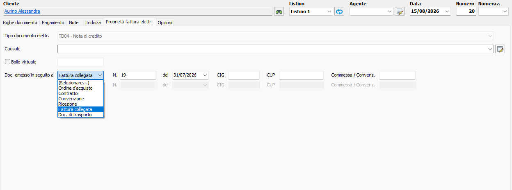

**Perché non si decide ora:** questa scheda vive in `fatturapa-xml.util.ts` e `document-xml.service.ts`, due dei quattro file contesi. Progettarla adesso significa progettare dentro il lavoro che il collega deve riconciliare, su un formato le cui regole non le decide nessuno dei due.

**Il piano descrittivo (A.7) e il piano strutturato (questo) restano separati.** Le righe di riferimento nel corpo non sostituiscono questi campi, e questi campi non sostituiscono le righe.

**C.3-ter — Archivio XML immutabile: IN SOSPESO** (dichiarato 15/08).

Il principio è già deciso in §1-bis: il documento salvato non cambia, e l'XML trasmesso è il caso limite — rigenerarlo dai dati di oggi produrrebbe un file diverso da quello che l'Agenzia ha ricevuto. Ma **l'implementazione resta sospesa**: non è in `develop`, non è verificato se esista sul ramo del collega, e la conservazione a norma ha regole che non decide nessuno dei due.

Da riprendere quando il ramo rientra. Non blocca nessun altro lavoro.

---

Da `VESTIF_2.MD` §39: provider e canale di trasmissione realmente previsto, responsabilità della conservazione, regola del tag `<Numero>`, stati elettronici da esporre e distinzione B2B/B2C/PA, quali proprietà FatturaPA opzionali supportare nella prima versione, compilazione dei riferimenti elettronici per la NC manuale senza fattura VestiFlow.

---

# BLOCCO D · Pagamenti / Tesoreria

**Stato: DECISO 15/08 che si fa.** Il modulo entra nel perimetro di VestiFlow.
**Destinazione:** documento di specifica nuovo, **da scrivere** (la specifica tesoreria oggi non esiste).

## D.0 · Cosa è stato deciso

**DECISO 15/08.** Il pagamento vive in **due luoghi distinti e complementari**:

1. **Sui documenti di vendita** — una scheda `Pagamento` dentro la maschera del documento, dove si definiscono le scadenze e si registrano i saldi di quel documento.
2. **In una sezione Pagamenti autonoma** — il registro trasversale per la gestione e il controllo di tutti i pagamenti.

Non sono due viste della stessa cosa: la scheda guarda **un documento**, il registro guarda **il denaro**.

## D.1 · Il costo vero di questo blocco

⚠️ **Migration.** È il blocco di migration più grande mai affrontato su VestiFlow: scadenze/partite, movimenti finanziari reali, allocazioni, risorse finanziarie, giroconti. Tutte **additive**.

**Quante tabelle: stima, non requisito.** L'ordine di grandezza è la decina, ma **non è misurato**. Prima di disegnare qualunque struttura vanno verificati: `DocumentPaymentInstallment`, `store_sale_payments`, `cash_sessions` (ramo cassa, mai misurato), e le **tabelle presenti nel database ma assenti da `schema.prisma`** — sono 74 contro 64, e qualcuna potrebbe già riguardare i pagamenti. Il riuso potrebbe ridurre di molto il numero di strutture nuove.

Questo, non il codice, è il costo reale. Va pianificato, non improvvisato: ogni migration applicata è rischio immediato per entrambi gli sviluppatori e per il pubblicato.

## D.2 · Il modello a quattro concetti

**Modello di riferimento**, coerente con `VESTIF_2.MD` §17 e **confermato dall'osservazione diretta di Danea**:

1. condizione / piano di pagamento — ciò che è previsto;
2. scadenza / partita aperta — ciò che resta da regolare;
3. movimento finanziario reale — denaro entrato o uscito davvero;
4. allocazione — quota del movimento applicata a una o più partite.

Con la regola: **un movimento può regolare N partite, una partita può essere regolata da N movimenti.**

**Conferma visiva** (dettaglio in A.9): la scheda `Pagamento` della maschera documento espone esattamente i quattro concetti — `Data scadenza` (la partita), `Data saldo` + `Importo` (il movimento reale), `Risorsa` (la risorsa finanziaria), e il comando `Preesistente` (l'allocazione: aggancia a questo documento un movimento già registrato, cioè il caso «un bonifico salda tre fatture»). I totali `Da saldare` e `Saldato` sono tenuti distinti.

Non è un modello teorico preso da un mandato: è ciò che un gestionale in uso mostra all'operatore.

## D.3 · Il registro Pagamenti — osservato su Danea il 15/08

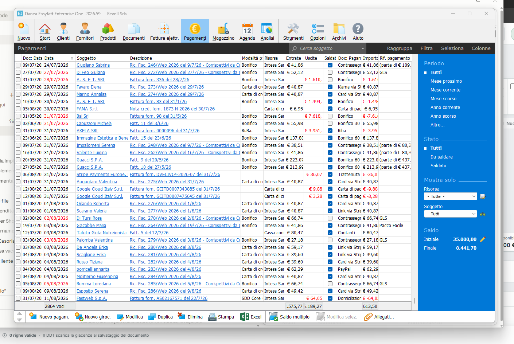

**È un registro trasversale ai documenti e ai cicli.** Nello stesso elenco convivono ricevute fiscali da corrispettivi web, fatture fornitore, note di credito fornitore: il registro guarda il denaro, non il tipo di documento.

**Colonne osservate:**

| Colonna                                      | Contenuto                                                                                                      |
| -------------------------------------------- | -------------------------------------------------------------------------------------------------------------- |
| `Doc. Data` · `Data`                         | data del documento e data del pagamento, **distinte**. Alcune date compaiono in rosso                          |
| `Soggetto`                                   | cliente o fornitore, come collegamento                                                                         |
| `Descrizione`                                | il documento d'origine, come collegamento (`Fattura forn. 336 del 28/7/26`)                                    |
| `Modalità p.`                                | Bonifico, Carta di credito, Ri.Ba., SDD Core, Cassa contanti                                                   |
| `Risorsa`                                    | la risorsa finanziaria (`Intesa Sanpaolo`)                                                                     |
| `Entrate` · `Uscite`                         | **due colonne separate**, non un importo con segno                                                             |
| `Saldato`                                    | casella                                                                                                        |
| `Doc. Pagam.` · `Importo` · `Rif. pagamento` | riferimenti del pagamento (`Contrassegno`, `GLS`, `Card via Stripe`, `PayPal`, `Domiciliazione`, `Trattenuta`) |

**Filtri laterali:** Periodo (Tutti, Mese prossimo, Mese corrente, Mese scorso, Anno corrente, Anno scorso, Altro), Stato (Tutti, Da saldare, Saldato), e filtri per Risorsa e Soggetto.

**Saldo:** `Iniziale` e `Finale`. Il valore iniziale **dipende dal periodo filtrato** — vedi sotto.

**Comandi:** `Nuovo pagam.`, **`Nuovo giroc.`** (giroconto: spostamento fra risorse, non entrata né uscita), `Modifica`, `Duplica`, `Elimina`, `Stampa`, `Excel`, **`Saldo multiplo`** (il caso «un bonifico salda N partite»), `Modifica selez.`, `Allegati`.

### L'allocazione parziale è visibile all'operatore

Nella colonna `Importo` compaiono voci come:

- `€ 38,51 (parte di € 80,37)` · `€ 41,86 (parte di € 80,37)` — modalità Contrassegno, rif. `GLS`
- `€ 223,07 (parte di € 437,06)` · `€ 213,99 (parte di € 437,06)` — Bonifico 60 gg F.M.

**È il modello a quattro concetti mostrato in atto.** Il movimento reale è uno — un riversamento del corriere da € 80,37, un bonifico da € 437,06 — e viene **allocato su più partite**. Il registro dichiara sia la quota applicata a questa partita, sia il totale del movimento da cui proviene.

Va tenuto come requisito di interfaccia, non solo di modello: l'operatore deve poter vedere di quale movimento fa parte una quota, senza aprire altro.

### Il saldo dipende dal periodo filtrato

⚠️ **Correzione a un'osservazione precedente.** Il saldo iniziale **non è un valore digitato una volta**: cambia col filtro. Senza filtro (2864 voci) è `35.000,00`; con «Anno corrente» (391 voci) è `16.585,71`. Il finale resta `8.441,70` in entrambi i casi.

È quindi il **saldo all'inizio del periodo mostrato**. L'icona di modifica accanto suggerisce che sia comunque impostabile — probabilmente per dichiarare il punto di partenza quando si adotta il gestionale a metà anno, che è lo stesso problema della prima sincronizzazione Shopify. _Non verificato._

### Due osservazioni da verificare, non misurate

| #     | Osservazione                                                                                                                                | Ipotesi                                                                                                                                                                                                                     |
| ----- | ------------------------------------------------------------------------------------------------------------------------------------------- | --------------------------------------------------------------------------------------------------------------------------------------------------------------------------------------------------------------------------- |
| D.3.1 | I totali di colonna (entrate `18.070,78`, uscite `33.594,56`, differenza `-15.523,78`) **non tornano** col saldo iniziale e finale mostrati | Il saldo conterebbe **solo i movimenti saldati**: le righe con casella vuota sono previsioni, non denaro. Se confermato, è la prova della separazione fra partita e movimento reale — **le scadenze non entrano nel saldo** |
| D.3.2 | Le date in rosso nella colonna `Data` corrispondono alle righe con `Saldato` **vuoto**                                                      | Scadenza passata e non incassata, segnalata nell'elenco senza aprire nulla. Requisito di interfaccia, non di modello                                                                                                        |

**Tre cose che questa schermata dimostra e che la scheda dentro il documento non mostrava:**

1. **Il registro è autonomo.** Si può creare un pagamento da qui, senza partire da un documento.
2. **Il giroconto esiste come concetto a sé.** Spostare denaro fra due risorse proprie non è né un incasso né un pagamento, e va modellato come tale.
3. **Entrate e Uscite sono colonne separate.** Scelta coerente con la vostra decisione sul verso dato dal tipo, non dal segno nella quantità.

## D.4 · Dipendenza dal ramo `feature/cassa`

`VESTIF_2.MD` §39.7 chiede se riusare `store_sale_payments` e `cash_sessions`. **`cash_sessions` è materia del ramo cassa del collega**, mai misurato.

**Conseguenza:** il blocco D non è indipendente dal collega più di quanto lo sia il blocco C. La stessa domanda del ramo fatturazione elettronica tornerà da quel lato, e prima di aprire il blocco D quel ramo va misurato.

## D.5 · Confini già decisi che il blocco D non deve violare

| #     | Voce                                                                                                                                                                                                                                                                                       | Stato            |
| ----- | ------------------------------------------------------------------------------------------------------------------------------------------------------------------------------------------------------------------------------------------------------------------------------------------ | ---------------- |
| D.5.1 | I **Corrispettivi** sono un registro derivato dalle vendite: consultabili, non documenti modificabili, non scadenzario, non prima nota, non sede di registrazione manuale di incassi                                                                                                       | **DECISO 14/08** |
| D.5.2 | Il **Contrassegno** è un metodo/tipo di pagamento, non un documento. Nessun incasso bancario creato al checkout Shopify solo perché il metodo è COD, e i Corrispettivi non sono la sede dove registrarlo a mano. In Danea compare come `Rif. pagamento`, cioè un'annotazione sul movimento | **DECISO 15/08** |
| D.5.3 | **Regola della fotografia**: per le vendite Shopify gli importi economici si conservano dalla transazione originale senza ricalcolo                                                                                                                                                        | **DECISO 15/08** |
| D.5.4 | **Nessuna modifica retroattiva automatica** (§1-bis): un pagamento registrato non cambia perché è cambiata l'anagrafica o la risorsa                                                                                                                                                       | **DECISO 15/08** |

---

# BLOCCO E · Quadro migration complessivo

Riepilogo di tutte le migration implicate, per rendere visibile il costo cumulato sul database condiviso.

| Blocco | Migration                                                                                                       | Tipo                             | Rischio                                                                                                                                       |
| ------ | --------------------------------------------------------------------------------------------------------------- | -------------------------------- | --------------------------------------------------------------------------------------------------------------------------------------------- |
| A      | `credit_note` nell'enum `DocumentType` (`20260807020000`)                                                       | Additiva                         | Basso. Da portare identica dal ramo del collega (checksum)                                                                                    |
| A      | Ricostruzione `documents_number_unique`                                                                         | Ricostruzione indice             | **Medio**: fallisce se esistono collisioni di numero. Verifica da rifare al momento                                                           |
| A      | Liste gestite dei campi trasporto (causale, incaricato, aspetto beni, porto) con seed uguale per tutti i tenant | Additiva                         | Basso. Nessuna colonna predefinito. Forma da scegliere: una tabella per lista, o una unica con discriminante                                  |
| C      | `20260807010000_tenant_tax_regime` — **da non applicare mai**                                                   | Additiva                         | **Nessuno**: verificato il 15/08 che non è mai stata applicata. Si scarta e basta                                                             |
| B      | —                                                                                                               | nessuna                          | —                                                                                                                                             |
| C      | Stati elettronici, archivio XML                                                                                 | Additive, entità non definite    | Da valutare dopo la decisione sul ramo                                                                                                        |
| D      | Scadenze, movimenti, allocazioni, risorse finanziarie, giroconti                                                | Additive, **numero da misurare** | **Il blocco più pesante. Deciso 15/08 che si fa.** La decina di tabelle è una stima: prima va verificato quanto è riusabile di ciò che esiste |

**Regole permanenti che valgono su tutte:**

- solo `prisma migrate deploy` negli ambienti condivisi — mai `migrate dev`, mai `db push`;
- le migration distruttive si fanno in **due tempi**;
- nessuna migration generata automaticamente per diff: nel database ci sono 74 tabelle contro 64 modelli in `schema.prisma`, un diff automatico proporrebbe drop;
- il codice torna indietro, il database no.

---

# 2 · Come usare questo documento

**Non va dato a Claude Code così com'è.** Contiene voci PROPOSTE e APERTE: consegnarlo intero significa chiedergli di trattare come specifica ciò che è materiale da decidere.

Il giro corretto è:

1. **Luigi promuove.** Voce per voce, da PROPOSTO a DECISO o a scartato. Le riserve A.4 e le domande A.5 vanno chiuse prima, non dopo.
2. **Solo il promosso confluisce.** Le voci DECISE del blocco A vanno in `docs/07-specifica-famiglia-fattura.md`, quelle del blocco B in `docs/04-specifica-numerazione-documenti.md`. Nessun altro file.
3. **Claude Code riceve un incarico nominato**, non «aggiorna i documenti»: quali file, quali sezioni, quali voci. Prima di creare un file nuovo deve verificare se esiste già — la specifica di prima sincronizzazione Shopify esisteva ed è stata riscritta per questo motivo.
4. **Blocco C:** ramo eliminato (decisione 15/08), quindi la fatturazione elettronica entra **subito nella ricognizione** e si riscrive da zero su `develop`. Vincolo: prelevare la migration dell'enum identica **prima** della cancellazione. **Blocco D:** deciso che si fa; prima va misurato `feature/cassa` e verificato quanto è riusabile di ciò che esiste già.

---

## 3 · Cosa manca a questo documento

Dichiarato per onestà, non per completezza futura:

- Le voci del mandato GPT relative ai blocchi C e D sono riportate **per titolo di sezione**, non nel dettaglio del corpo: le sezioni FE-C → FE-R e §20-29 non sono state lette riga per riga in questa revisione.
- Il ramo `feature/fattura-elettronica` **ora è misurato** (C.1), ma restano due punti ciechi: non è verificato se i 14 difetti della revisione avversariale siano ancora vivi in `develop`, e i 34 file contesi non sono stati letti riga per riga — solo dimensionati.
- Il ramo **`feature/cassa` non è mai stato misurato.** Potrebbe essere nella stessa situazione. `cash_sessions` è materia sua e il blocco D ci si appoggia (D.3): la stessa domanda tornerà da quel lato.
- Il mandato GPT cita quattro file `.docx` (Contesto Master, Piano Master Verifica, Specifica Verifica 14-08, Analisi Pagamenti Tesoreria v2.0) e due file `docs/` con **numerazione invertita** rispetto alla vostra (`06-specifica-famiglia-fattura`, `07-note-merge-fatture`; da voi 06 sono le note di merge e 07 la specifica). L'esistenza dei `.docx` non è verificata.
